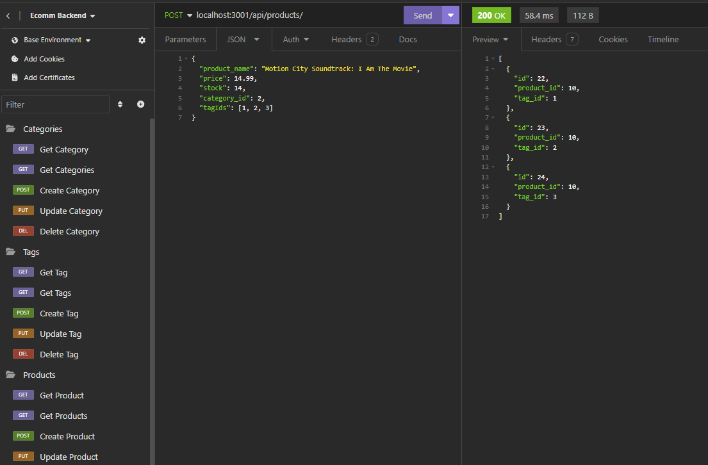

# Ecommerce Backend Redesign

## Description

Updated the backend of this site to use sequalize and express.

## Table of Contents

- [Installation](#installation)
- [Usage](#usage)
- [License](#license)
- [Contributing](#contributing)
- [Tests](#tests)
- [Questions](#questions)
- [Repo](#repo)

## Installation

Clone the repository run npm i in the root

## Usage

Use as a backend to your ecomm site

## Contributing

Give me a front end for this masterpiece

## Tests

No testing currently

## Questions

For any questions, please contact me at [j.browning527@gmail.com](mailto:j.browning527@gmail.com) or visit my [GitHub profile](https://github.com/jbrowning824).

This project is licensed under the MIT License. For more information, see the link below:
    [Lincense Link] (https://api.github.com/licenses/mit)

## Repo

Check out the repo [ECommerce-Backend-Redesign](https://github.com/jbrowning824/ECommerce-Backend-Redesign)

View the [walkthrough](https://drive.google.com/file/d/1xD3xZPXheZePQzSCooCxZA18ebrHEehT/view)